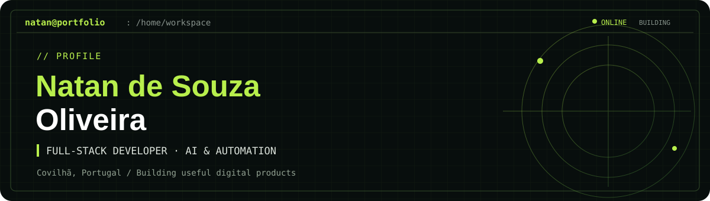

**I build products that turn complex workflows into simple experiences.**

Computer Engineering student at UBI · Covilhã, Portugal

[About](#hey-im-natan-) · [Projects](#selected-work) · [Toolkit](#the-toolkit) · [Contact](#contact)

---

### Hey, I'm Natan 👋

I design and ship web products, from the first interface to the database and deployment. My work sits at the intersection of **full-stack development, AI integrations and useful automation**. I also enjoy turning a client brief into something people can actually try.

Currently studying **Computer Engineering at Universidade da Beira Interior** and working on freelance projects. I'm open to **remote, part-time opportunities** where I can keep building and learning.

### Selected work

<table>
<tr>
<td width="50%" valign="top">
<h3>🎧 <a href="https://github.com/natsouzax/lexuri">Lexuri</a></h3>

<strong>Learn English through the music you love</strong>

A research prototype with synced lyrics, tap-to-translate vocabulary and a three-day review cycle. Learners turn their takeaways into verses of their own song.

<code>Next.js</code> <code>TypeScript</code> <code>Supabase</code> <code>OpenAI</code>

<a href="https://github.com/natsouzax/lexuri">Explore the code →</a> · <a href="https://lexuri-validacao.vercel.app">Try the prototype →</a>

</td>
<td width="50%" valign="top">
<h3>💸 <a href="https://github.com/natsouzax/fluxo">Fluxo</a></h3>

<strong>Finances, notes and routine in one app</strong>

A React Native MVP with a contextual AI copilot. It has local persistence and an Anthropic integration; bank data and sign-in are currently demos.

<code>React Native</code> <code>Expo</code> <code>TypeScript</code> <code>Zustand</code>

<a href="https://github.com/natsouzax/fluxo">Explore the code →</a>

</td>
</tr>
<tr>
<td width="50%" valign="top">
<h3>🛍️ <a href="https://github.com/natsouzax/Interactive-proposal-for-LS-Store">LS Store proposal</a></h3>

<strong>A sales proposal you can click through</strong>

An interactive client-facing demo that shows the proposed product experience instead of relying on a static pitch.

<code>Next.js</code> <code>React</code> <code>TypeScript</code> <code>Vercel</code>

<a href="https://github.com/natsouzax/Interactive-proposal-for-LS-Store">Explore the code →</a> · <a href="https://ls-store.vercel.app/">View the demo →</a>

</td>
<td width="50%" valign="top">
<h3>⚡ What I'm exploring</h3>

<strong>Practical AI and automation</strong>

I like building tools that reduce repetitive work, clarify decisions and make software feel approachable. I'm also exploring robotics during my degree.

<code>AI integrations</code> <code>APIs</code> <code>Automation</code> <code>Robotics</code>

<a href="https://github.com/natsouzax?tab=repositories">See all repositories →</a>

</td>
</tr>
</table>

<strong>✨ What happens when you open Lexuri?</strong>

Choose a song → listen with synced lyrics → save new words → review them over three days → turn your takeaways into a verse.

[Explore the product →](https://github.com/natsouzax/lexuri)

### The toolkit

| Build | Connect & ship |
| :-- | :-- |
| TypeScript · JavaScript · Python · SQL | Supabase · Postgres · APIs · Git |
| Next.js · React · React Native · Tailwind CSS | OpenAI · Anthropic · Vercel · Railway |

<strong>More about my path</strong>

 

- Freelance web developer creating websites and digital experiences for clients.
- Technical support and workflow automation experience at BitJuris.
- Project work with EmComp, a junior enterprise.
- Technical training in Informatics at IF Sudeste MG, including hands-on hardware and software projects.

---

**Have a project or opportunity in mind?**

[LinkedIn](https://www.linkedin.com/in/natan-de-souza-oliveira-it) · [Email](mailto:oliveira.natan.dev@gmail.com) · [GitHub](https://github.com/natsouzax)

Made with curiosity in Covilhã 🇵🇹

